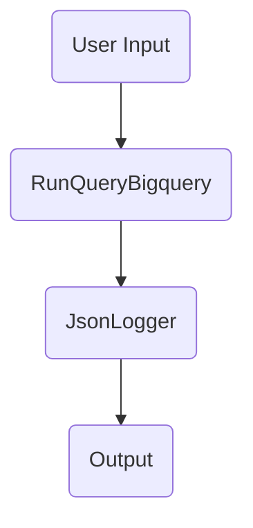

# gcp-workflows-example

This repo contains a simple contrived google cloud Workflows workflow, illustrating how GCP Workflows works, and what it can do.

The workflow does the following:



1. User starts ("executes") the workflow, providing JSON input containing a SQL query e.g. ``{"query_string": "SELECT * FROM `proj.dataset.table`;"}``

2. The user-provided SQL query is passed to a google Cloud Function (RunQueryBigquery) which executes the query on google BigQuery.

3. The result of the query on Bigquery is passed by the Cloud Function RunQueryBigquery to another Cloud Function called JsonLogger (via JSON). This function simply logs the JSON provided to it in google cloud logging.

4. The Cloud Function JsonLogger then returns the datetime at which it finished running back to google Workflows (via JSON), and this result is then visible in the google Workflows UI.

IMPORTANT NOTE: For simplicity, I am allowing unauthenticated access on the cloud functions. DO NOT DO THIS IN A PRODUCTION APPLICATION (use a service account with strict permissions).

The folder structure of this repo is as follows:

```bash
├── README.md
├── clean_up_gcp.sh  # deletes all GCP resources created by this example
├── cloud_functions
│   ├── json_logger
│   │   ├── deploy_cloud_function.sh
│   │   ├── main.py
│   │   └── requirements.txt
│   └── run_query_bigquery
│       ├── deploy_cloud_function.sh
│       ├── main.py
│       └── requirements.txt
├── deploy_cloud_functions.sh # deploys the 2 cloud functions
└── gcp_workflow.yaml # defines the entire GCP workflow
```

Here is the code to run the example:

```bash
# deploy the cloud functions #
GCP_PROJECT_ID='your-gcp-proj-id'
GCP_REGION='europe-west2'
source deploy_cloud_functions.sh

# Save the Cloud Function URIs in variables to use later #
# (cloud function URIs are shown in terminal when function is deployed) #
RUN_QUERY_BIGQUERY_URI='https://put-your-cloud-function-uri-here'
JSON_LOGGER_URI='https://put-your-cloud-function-uri-here'

# test out the cloud functions #
curl -m 30 -X POST $RUN_QUERY_BIGQUERY_URI \
    -H "Authorization: Bearer $(gcloud auth print-identity-token)" \
    -H "Content-Type: application/json" \
    -d '{"query_string":"SELECT * FROM `projname.datasetname.tablename` LIMIT 69;"}'
# you will need to check GCP log explorer to see that this cloud function worked:
curl -m 30 -X POST $JSON_LOGGER_URI \
    -H "Authorization: Bearer $(gcloud auth print-identity-token)" \
    -H "Content-Type: application/json" \
    -d '[{"id": 1, "status":"BAD"}, {"id": 2, "status": "GOOD"}]'

# update some parameters in gcp_workflow.yaml (replace with your cloud function URIs) #
sed -i '' -e "7s@url: .*@url: ${RUN_QUERY_BIGQUERY_URI}@1" gcp_workflow.yaml
sed -i '' -e "14s@url: .*@url: ${JSON_LOGGER_URI}@1" gcp_workflow.yaml

# deploy the GCP workflow #
gcloud workflows deploy example-workflow \
    --source gcp_workflow.yaml \
    --project $GCP_PROJECT_ID \
    --location $GCP_REGION \
    --description 'An example workflow illustrating basic functionality of Google Workflows'

# run the GCP workflow #
gcloud workflows run example-workflow \
    --project $GCP_PROJECT_ID \
    --location $GCP_REGION \
    --data '{"query_string":"SELECT * FROM `projname.datasetname.tablename` ORDER BY RAND() LIMIT 10;"}'

# clean up #
source clean_up_gcp.sh
```
